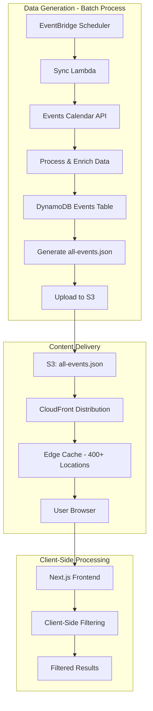
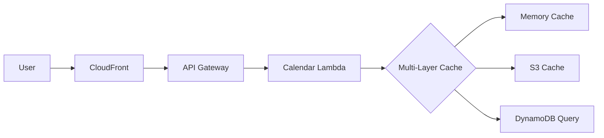
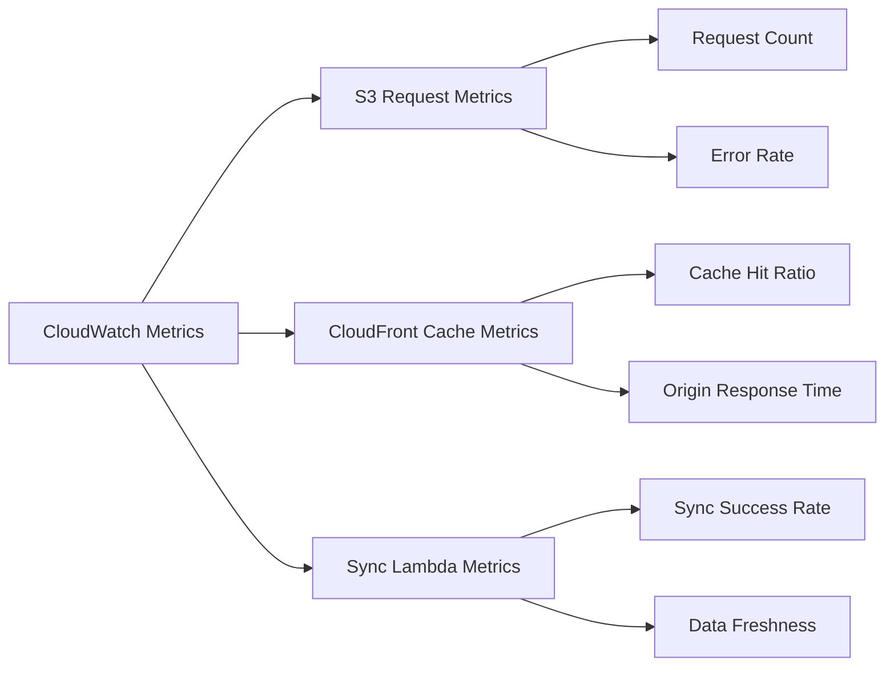

# Caching Architecture

The Chautauqua Calendar application implements a streamlined 2-layer caching system optimized for static file delivery with global edge distribution.

## Current Architecture Overview

The application has evolved from a complex 4-layer Lambda-based caching system to a simplified static file architecture that leverages AWS CloudFront for global distribution.


## Cache Layers Overview

### Layer 1: Browser Cache (Client-Side)
- **Location**: End user's browser
- **Duration**: 1 hour (via CloudFront `Cache-Control` headers)
- **Purpose**: Eliminate redundant requests for static calendar data
- **Implementation**: HTTP cache headers served by CloudFront
- **Headers**: 
  - `Cache-Control: public, max-age=3600` 
  - `Expires: <timestamp>`

### Layer 2: CloudFront CDN Cache (Global Edge)
- **Location**: AWS CloudFront edge locations worldwide (400+ locations)
- **Duration**: 24 hours (configurable in Terraform)
- **Purpose**: Serve static JSON file from edge locations closest to users
- **File Cached**: `/data/all-events.json` (static file)
- **Configuration**: 
  - `default_ttl = 86400` (24 hours)
  - `max_ttl = 604800` (7 days)
  - Caches GET requests for static assets

## Data Flow Architecture

### Current Static File Architecture



### Request Flow Comparison

**Previous Architecture (Phases 1-4):**


**Current Architecture (Phase 5):**


## Configuration

### Terraform Configuration

```hcl
# CloudFront static file caching
default_cache_behavior {
  min_ttl     = 0
  default_ttl = 86400   # 24 hours
  max_ttl     = 604800  # 7 days
}

# S3 bucket for static files
resource "aws_s3_bucket" "frontend_bucket" {
  bucket = "chautauqua-calendar-frontend-${var.environment}"
}
```

### CloudFront Distribution Settings

```hcl
# Optimized for static JSON file delivery
distribution_config {
  enabled = true
  price_class = "PriceClass_All"  # Global distribution
  
  # Static file caching
  default_cache_behavior {
    target_origin_id = "S3-${aws_s3_bucket.frontend_bucket.bucket}"
    viewer_protocol_policy = "redirect-to-https"
    compress = true
    
    # Cache static JSON files aggressively
    cached_methods = ["GET", "HEAD"]
    cache_policy_id = aws_cloudfront_cache_policy.static_files.id
  }
}
```

## Cache Invalidation

### Automatic Data Updates
- **Scheduled Updates**: EventBridge triggers sync Lambda hourly for current events
- **File Regeneration**: Complete all-events.json file regenerated from DynamoDB data
- **Automatic Upload**: New file uploaded to S3, triggering CloudFront cache invalidation

### Manual Invalidation
- **CloudFront Invalidation**: Automatic via deployment scripts after new file upload
- **Deployment Process**: GitHub Actions triggers invalidation after frontend deployment

## Performance Benefits

### Performance Improvements vs. Previous Architecture

| Scenario | Previous (Lambda + Caching) | Current (Static Files) | Improvement |
|----------|----------------------------|----------------------|-------------|
| First-time user | ~2000ms DynamoDB + Lambda | ~50ms CloudFront edge | **40x faster** |
| Repeat user | ~50ms browser cache | ~10ms browser cache | **5x faster** |
| Global users | ~500ms regional Lambda | ~20ms local edge | **25x faster** |
| High traffic | Lambda scaling delays | Instant edge serving | **Unlimited scaling** |

### Architectural Benefits

**Performance:**
- **Zero Compute Latency**: No Lambda cold starts for event data
- **Global Edge Distribution**: 400+ CloudFront locations worldwide
- **Instant Scaling**: Static files handle any traffic volume
- **Client-Side Filtering**: All filtering happens in browser for instant results

**Cost Optimization:**
- **No Lambda Invocations**: For event data requests (99% of traffic)
- **No API Gateway Charges**: For event endpoints
- **Minimal DynamoDB Reads**: Only for data sync and admin operations
- **Predictable Costs**: Storage + bandwidth only for event delivery

**Reliability:**
- **No Single Point of Failure**: Static files are highly available
- **Graceful Degradation**: Cached data survives sync failures
- **Simplified Architecture**: Fewer moving parts to maintain

## Implementation Details

### Static File Generation

The current architecture eliminates complex caching logic in favor of simple static file generation:

```typescript
// Simplified data flow in sync Lambda
async function generateStaticFile() {
  // 1. Query all events from DynamoDB
  const allEvents = await dynamodb.scan({
    TableName: 'ChautauquaEvents'
  }).promise();

  // 2. Process and enrich event data
  const processedEvents = allEvents.Items.map(processEvent);

  // 3. Generate static JSON file
  const staticData = {
    events: processedEvents,
    lastUpdated: new Date().toISOString(),
    metadata: {
      totalEvents: processedEvents.length,
      dataSource: 'events-calendar-api'
    }
  };

  // 4. Upload to S3
  await s3.putObject({
    Bucket: 'chautauqua-calendar-frontend-prod',
    Key: 'data/all-events.json',
    Body: JSON.stringify(staticData),
    ContentType: 'application/json',
    CacheControl: 'public, max-age=86400'
  }).promise();
}
```

### Client-Side Processing

All filtering and search happens client-side for instant results:

```typescript
// Frontend fetches static file once
const response = await fetch('/data/all-events.json');
const data = await response.json();

// All subsequent filtering is client-side
const filteredEvents = data.events.filter(event => {
  return matchesSearch(event, searchTerm) &&
         matchesWeek(event, selectedWeeks) &&
         matchesCategory(event, selectedCategories);
});
```

### Cache Headers

CloudFront serves static files with optimized cache headers:

```http
Cache-Control: public, max-age=86400
ETag: "abc123def456"
Last-Modified: Wed, 27 Jul 2025 10:00:00 GMT
Content-Type: application/json
Content-Encoding: gzip
```

## Monitoring & Observability

### Static File Monitoring

Since the architecture uses static files, monitoring focuses on:



### Key Metrics

**CloudFront Performance:**
- Cache hit ratio (target: >95%)
- Origin response time (target: <100ms)
- Error rate (target: <0.1%)

**Data Freshness:**
- Last sync timestamp in all-events.json
- Sync success rate (target: 100%)
- Time since last successful update

**S3 Performance:**
- Request volume and patterns
- Error rates for static file requests

## Security Considerations

### Static File Security
- **Public Access**: Static JSON files are intentionally public
- **Content Security**: No sensitive data in event information
- **HTTPS Only**: All access via CloudFront with SSL/TLS

### Infrastructure Security
- **S3 Bucket Security**: Restricted write access to sync Lambda only
- **CloudFront Security**: HTTPS enforcement, security headers
- **Lambda Permissions**: Minimal IAM roles for sync operations

## System Advantages

### Architectural Simplicity
The move to static files provides significant advantages:

1. **Elimination of Complex Systems**:
   - No multi-layer cache management
   - No cache invalidation strategies
   - No cache key generation logic
   - No memory management concerns

2. **Improved Reliability**:
   - Static files never "miss" or fail
   - No cache warming required
   - No cache coherency issues
   - Predictable performance

3. **Simplified Operations**:
   - No cache monitoring dashboards needed
   - No cache-related debugging
   - Straightforward deployment process
   - Clear data flow

## Migration Benefits

### From Complex to Simple

The evolution from a 4-layer caching system to static files demonstrates:

**Before (Complex Caching):**
- Memory cache + S3 cache + DynamoDB
- Cache invalidation logic
- Multiple failure points
- Complex monitoring requirements

**After (Static Files):**
- Single static JSON file
- CloudFront edge distribution
- Simple update process
- Minimal monitoring needs

## Troubleshooting

### Static File Issues

1. **Stale Data**: Check sync Lambda execution and all-events.json timestamp
2. **File Not Found**: Verify S3 bucket deployment and CloudFront configuration  
3. **Slow Loading**: Check CloudFront cache hit ratio and edge location coverage
4. **Large File Size**: Monitor JSON file size and consider optimization

### Debug Information

**Check File Status:**
```bash
# Verify file exists and freshness
curl -I https://www.chqcal.org/data/all-events.json

# Check file content and metadata
curl https://www.chqcal.org/data/all-events.json | jq '.metadata'
```

**CloudFront Debugging:**
- CloudFront access logs (if enabled)
- Real-time monitoring in AWS Console
- Cache behavior configuration review

---

*This simplified architecture represents a significant improvement in reliability, performance, and maintainability compared to the previous multi-layer caching system.*