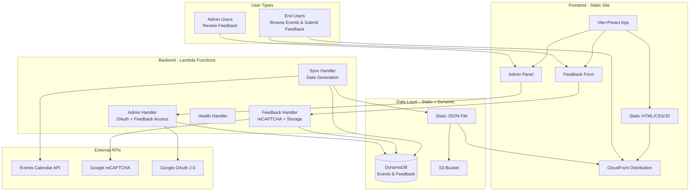
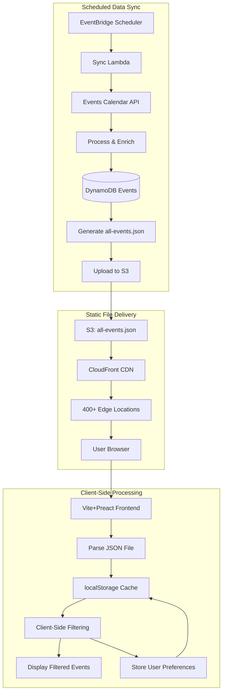
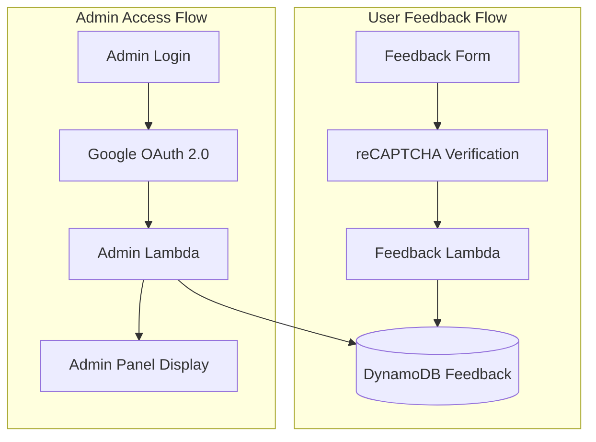

# Chautauqua Calendar - Design Document

## Overview

The Chautauqua Calendar is a full-stack serverless application designed to provide a dynamic, filterable calendar for the Chautauqua Institution summer season. This document outlines the comprehensive architecture, design decisions, and assumptions that guide the development of this project.

## Table of Contents

1. [System Architecture](#system-architecture)
2. [Frontend Design](#frontend-design)
3. [Backend Design](#backend-design)
4. [Infrastructure Design](#infrastructure-design)
5. [Data Models](#data-models)
6. [Development Workflow](#development-workflow)
7. [Key Assumptions](#key-assumptions)
8. [Design Decisions](#design-decisions)
9. [Performance Considerations](#performance-considerations)
10. [Security Considerations](#security-considerations)

---

## System Architecture

### High-Level Architecture



### Development vs Production

**Production:**
- Frontend served via CloudFront CDN
- Static event data from `/cache/calendar-cache/all-events.json`
- Lambda functions for data sync and feedback only

**Development:**
- Local Vite dev server
- Production API endpoints for backend functionality
- Local DynamoDB for testing

### Technology Stack

- **Frontend**: Vite 7, Preact 10, TypeScript, Tailwind CSS 4
- **Backend**: AWS Lambda (Node.js 24.x), Express.js (local dev), TypeScript
- **Database**: DynamoDB (AWS/Local)
- **Infrastructure**: AWS (S3, CloudFront, API Gateway, Lambda, DynamoDB)
- **Development**: Docker Compose, Jest, ESBuild
- **Deployment**: Terraform, AWS CLI

---

## Frontend Design

### Framework & Architecture

**Vite + Preact**
- Multi-page static application
- Static build for production deployment
- TypeScript for type safety
- Preact hooks for state management

### Component Structure

Vite builds a multi-page static app. Each page has its own HTML entry plus
a TypeScript entry under `src/entries/`. Page components live under
`src/app/`. Reusable code is organized by responsibility.

```
frontend/
├── index.html                   # Main calendar HTML entry
├── feedback/, publish/, admin/… # Per-page directories with `index.html` entries
└── src/
    ├── entries/                 # One entry file per page (mounts a component)
    │   ├── main.tsx
    │   ├── admin.tsx
    │   ├── publish-apply.tsx
    │   └── ...
    ├── app/                     # Page-level components
    │   ├── page.tsx             # Main calendar
    │   ├── globals.css          # Tailwind + custom CSS
    │   ├── feedback/
    │   ├── publish/
    │   └── admin/
    │       ├── feedback/
    │       ├── login/
    │       ├── publishers/
    │       └── publisher-events/
    ├── components/              # Reusable UI components
    ├── hooks/                   # Custom Preact hooks
    ├── lib/                     # Utilities (auth, helpers, search, dates)
    └── types/                   # Shared type definitions
```

Adding a new page means adding an `index.html`-style file, a matching
entry in `src/entries/`, and registering it in
`vite.config.ts`'s `rollupOptions.input` map.

### Key Design Principles

1. **Mobile-First Responsive Design**
   - Adaptive UI for mobile, tablet, and desktop
   - Touch-friendly interactions with horizontal scrolling
   - Progressive enhancement with scroll indicators

2. **Client-Side Performance**
   - All filtering happens client-side for instant results
   - Memoized components to prevent unnecessary re-renders
   - Efficient state management with React hooks and localStorage persistence
   - FIFO recent items tracking (10 most recent, display 3+ as pills)

3. **User Experience**
   - Intuitive week-based navigation with visual feedback
   - Smart search with location/category shortcuts and aliases
   - HTML entity decoding for proper text display
   - Expandable filter sections with chevron animations
   - Recent items pills with responsive design and overflow scrolling

### State Management

**React Hooks with localStorage Persistence:**
```typescript
// Main state structure with localStorage integration
const [events, setEvents] = useState<ChautauquaEvent[]>([]);
const [filteredEvents, setFilteredEvents] = useState<ChautauquaEvent[]>([]);
const [selectedWeeks, setSelectedWeeks] = useState<Set<number>>(new Set());
const [searchTerm, setSearchTerm] = useState<string>('');
const [selectedTags, setSelectedTags] = useState<Set<string>>(new Set());

// Recent items tracking (FIFO with localStorage persistence)
const [recentLocations, setRecentLocations] = useState<string[]>([]);
const [recentCategories, setRecentCategories] = useState<string[]>([]);
```

**localStorage Integration:**
- **Event Data**: Complete event dataset cached for offline use
- **User Preferences**: Filter selections persist across browser sessions
- **Recent Items**: FIFO tracking of recently-used locations and categories
- **Session State**: Last selected filters restored on page reload

### Search & Filtering System

**Smart Search Shortcuts:**
- 'amp' → 'amphitheater'
- 'cso' → 'Chautauqua Symphony Orchestra'
- 'clsc' → 'Chautauqua Literary and Scientific Circle'

**Multi-Dimensional Filtering:**
- Week-based filtering (Chautauqua season weeks 1-9)
- Tag-based categorization
- Full-text search across titles and descriptions
- Combined filters with logical AND operations

### Styling Architecture

**Tailwind CSS 4 with PostCSS:**
- Utility-first approach for consistency
- Custom color palette for Chautauqua branding
- Responsive breakpoints: mobile (default), tablet (md), desktop (lg)
- Dark mode support (future enhancement)

---

## Backend Design

### Runtime Environment

**AWS Lambda with Node.js 24.x**
- Serverless compute for cost efficiency
- Auto-scaling based on demand
- TypeScript compilation with ES2020 target
- ESBuild for optimized bundling

### API Architecture

**Current API Design:**
```
GET  /cache/calendar-cache/all-events.json  # Static calendar data (via CloudFront)
POST /sync                                   # Trigger manual data sync
GET  /health                                # Health check endpoint
POST /feedback                              # Submit feedback (reCAPTCHA protected)
GET  /admin/feedback                        # Admin feedback access (OAuth protected)
```

**Handler Structure:**
```
src/handlers/
├── syncHandler.ts        # Data synchronization and static file generation
├── healthHandler.ts      # Health monitoring
├── feedbackHandler.ts    # Feedback submission
└── adminHandler.ts       # Admin authentication and feedback access
```

### Service Layer

**Core Services:**
1. **DataSyncService** - Manages data synchronization and static file generation
2. **EventsCalendarApiService** - Integrates with Events Calendar REST API
3. **DatabaseService** - Abstracts DynamoDB operations
4. **CategoryService** - Handles event categorization
5. **FeedbackService** - Manages feedback submission and retrieval
6. **AdminAuthService** - Handles OAuth authentication for admin access

### Data Synchronization Strategy

**Scheduled Sync Frequency:**
- **Current Events**: Hourly updates via EventBridge
- **Full Season Sync**: Daily updates for complete dataset
- **Manual Sync**: Available via `/sync` endpoint for immediate updates

**Sync Process:**
1. Fetch events from Events Calendar REST API
2. Process and enrich event data (venues, categories, presenters)
3. Store in DynamoDB Events table
4. Generate complete static JSON file from DynamoDB data
5. Upload `all-events.json` to S3 for CloudFront distribution
6. Trigger CloudFront cache invalidation

### Database Design

**DynamoDB Schema:**
```
Table: ChautauquaEvents
- Partition Key: uid (string)
- Sort Key: N/A (single-item table)
- Attributes: id, title, description, startDate, endDate, venue, categories, etc.

Table: ChautauquaFeedback
- Partition Key: id (string)
- Sort Key: N/A
- Attributes: message, email, timestamp, status, etc.

Global Secondary Indexes (Events):
- WeekIndex: week (PK) + startDate (SK)
- DateIndex: startDate (PK)
- CategoryIndex: category (PK) + startDate (SK)
```

### Event Processing Pipeline

**API Integration & Enhancement:**
1. Fetch structured event data from Events Calendar REST API
2. Transform API response to ChautauquaEvent format
3. Extract venue information (ID, name, address)
4. Process hierarchical categories and relationships
5. Extract presenters from event titles using regex patterns
6. Generate tags from descriptions and categories
7. Calculate Chautauqua season week numbers
8. Enrich with additional metadata (images, cost, featured status)

---

## Infrastructure Design

### AWS Cloud Architecture

**Core Services:**
- **S3**: Static website hosting with versioning
- **CloudFront**: Global CDN with custom domain (chqcal.org)
- **API Gateway**: RESTful API routing to Lambda functions
- **Lambda**: Serverless compute (3 functions)
- **DynamoDB**: NoSQL database with pay-per-request billing
- **Route 53**: DNS management and SSL certificates

**Security & SSL:**
- ACM SSL certificates with DNS validation
- HTTPS enforced with TLS 1.2 minimum
- CORS configuration for cross-origin requests
- IAM roles with least-privilege access

### Deployment Strategy

**Infrastructure as Code (Terraform):**
```
infrastructure/
├── main.tf              # Primary infrastructure
├── sync.tf              # Sync-related resources
└── cloudfront-function.js # Path rewriting
```

**Automated Deployment:**
- Frontend: Build → S3 → CloudFront invalidation
- Backend: Build → Lambda deployment
- Infrastructure: Terraform plan → apply

### Monitoring & Observability

**CloudWatch Integration:**
- Custom metrics for API performance
- Log aggregation from all Lambda functions
- Alarms for error rates and latency
- Dashboard for operational visibility

**Scheduled Operations:**
- EventBridge rules for automated syncing
- Health checks for API endpoints
- Database maintenance tasks

---

## Data Models

### ChautauquaEvent Interface

```typescript
interface ChautauquaEvent {
  uid: string;                    // Unique identifier
  title: string;                  // Event title
  description?: string;           // Event description
  startDate: string;              // ISO 8601 datetime
  endDate: string;                // ISO 8601 datetime
  location?: string;              // Venue/location
  category: string;               // Event category
  tags: string[];                 // Generated tags
  presenters: string[];           // Extracted presenters
  week: number;                   // Chautauqua season week (1-9)
  confidence: 'confirmed' | 'tentative' | 'placeholder' | 'TBA';
  syncStatus: 'synced' | 'pending' | 'error' | 'outdated';
  lastModified: string;           // ISO 8601 datetime
  source: 'chautauqua-ics';       // Data source
}
```

### Category System

**Event Categories:**
- **Lectures**: Morning lectures, interfaith programs
- **Music**: CSO concerts, chamber music, opera
- **Theater**: CTC productions, special performances
- **Visual Arts**: Gallery exhibitions, artist talks
- **Recreation**: Sports, fitness, family activities
- **Education**: CLSC, workshops, classes
- **Special Events**: Opening ceremonies, galas
- **Worship**: Services, chaplain programs

---

## Development Workflow

### Local Development Environment

**Docker Compose Setup:**
```yaml
services:
  frontend:     # Vite development server
  backend:      # Express.js API server
  dynamodb:     # DynamoDB Local
  dynamodb-admin: # Database management UI
```

**Development Scripts:**
- `./scripts/start-local.sh` - Start local environment
- `./scripts/test-local.sh` - Run comprehensive tests
- `./scripts/deploy-with-validation.sh` - Deploy with validation

### Testing Strategy

**Local Testing Requirements:**
1. Backend health checks
2. Frontend accessibility
3. API endpoint validation
4. Week filtering accuracy
5. Sync process verification
6. Database connectivity
7. Cross-week event distribution

**Deployment Validation:**
- Local testing must pass before production deployment
- Manual validation of key user flows
- Production verification after deployment

---

## Key Assumptions

### Business Logic Assumptions

1. **Chautauqua Season Structure**
   - 9-week season starting from the 4th Sunday of June
   - Season years are predictable (June-August)
   - Week numbering is consistent across the platform

2. **Event Data Assumptions**
   - ICS feed format remains stable
   - Event UIDs are unique and persistent
   - Last-modified timestamps are reliable for change detection

3. **User Behavior Assumptions**
   - Users primarily filter by week and search
   - Mobile usage is significant (mobile-first design)
   - Real-time updates are more important than perfect consistency

### Technical Assumptions

1. **Data Volume**
   - ~1000 events per season
   - Manageable for client-side filtering
   - DynamoDB performance adequate for read-heavy workload

2. **Performance Requirements**
   - API response time < 500ms for 95th percentile
   - Frontend load time < 3s on 3G connection
   - Search results appear instantly (client-side)

3. **Availability Requirements**
   - 99.5% uptime acceptable (not mission-critical)
   - Graceful degradation during outages
   - Cached data acceptable during sync failures

### Infrastructure Assumptions

1. **AWS Service Reliability**
   - Lambda cold start latency acceptable
   - DynamoDB consistent performance
   - CloudFront global distribution sufficient

2. **Cost Optimization**
   - Serverless architecture cost-effective for usage patterns
   - Pay-per-request pricing model optimal
   - Static hosting cheaper than server-based solutions

---

## Design Decisions

### Frontend Technology Choices

**Vite + Preact vs. Next.js:**
- **Chosen**: Vite 7 with Preact 10 (migrated from Next.js 15)
- **Rationale**: Smaller bundle size, faster builds, simpler architecture for a static site
- **Trade-offs**: No SSR capability, but not needed for this static application

**Client-Side vs. Server-Side Filtering:**
- **Chosen**: Client-side filtering with static file download
- **Rationale**: Instant results, no API calls needed, better UX, FIFO recent items tracking
- **Trade-offs**: Larger initial download (~1470 events), but cached globally via CloudFront

### Backend Architecture Decisions

**Lambda vs. Container-Based:**
- **Chosen**: AWS Lambda
- **Rationale**: Cost efficiency, auto-scaling, serverless benefits
- **Trade-offs**: Cold start latency, execution time limits

**DynamoDB vs. Relational Database:**
- **Chosen**: DynamoDB
- **Rationale**: Serverless, predictable performance, AWS integration
- **Trade-offs**: Query limitations, eventual consistency

### Data Architecture Strategy

**Pull vs. Push Model:**
- **Chosen**: Pull model with scheduled sync to static files
- **Rationale**: Chautauqua doesn't provide webhooks, static files eliminate API calls
- **Trade-offs**: Hourly update frequency, but offset by global caching

**Static File vs. Dynamic API:**
- **Chosen**: Static file generation from complete dataset
- **Rationale**: Maximum performance, global caching, eliminates Lambda costs
- **Trade-offs**: Complete file regeneration needed, but only ~1470 events

## Current Data Flow Architecture

### Event Data Delivery



### Feedback System Flow



---

## Performance Considerations

### Frontend Performance

**Static File Advantages:**
- Single JSON file download (~1470 events)
- Global CDN caching via CloudFront (400+ locations)
- No API latency for event data requests
- Client-side filtering provides instant results

**Offline Capabilities:**
- Complete event data cached in localStorage
- App functions without network connectivity after initial load
- User filter preferences persist across sessions
- Recently-used locations and categories stored locally

**Optimization Strategies:**
- React.memo for expensive components
- useMemo for complex calculations
- Efficient event filtering algorithms
- localStorage for data persistence and state management

**Metrics to Monitor:**
- First Contentful Paint (FCP)
- Largest Contentful Paint (LCP)
- Cumulative Layout Shift (CLS)
- Time to Interactive (TTI)

### Backend Performance

**Static File Generation:**
- Scheduled sync eliminates real-time processing
- Complete file regeneration from DynamoDB (~1470 events)
- S3 upload with CloudFront cache invalidation
- No Lambda cold starts for event data delivery

**Lambda Optimization (Feedback/Admin Only):**
- Minimal Lambda usage (only feedback and admin functions)
- Optimized bundle size with tree shaking
- Connection pooling for database operations
- Efficient JSON serialization

**Database Performance:**
- DynamoDB Events table for sync operations only
- DynamoDB Feedback table for admin functionality
- Strategic use of Global Secondary Indexes
- Query optimization with projection expressions

---

## Security Considerations

### Authentication & Authorization

**Current Implementation:**
- **Public Calendar Data**: No authentication required (static JSON file)
- **Feedback System**: Google reCAPTCHA verification for spam protection
- **Admin Access**: Google OAuth 2.0 authentication with whitelist validation
- **API Rate Limiting**: Through API Gateway for feedback/admin endpoints
- **CORS Configuration**: Secure cross-origin requests

**Security Features:**
- reCAPTCHA integration prevents automated spam
- OAuth 2.0 with Google provides secure admin authentication
- Email whitelist restricts admin access to authorized users
- Static file approach eliminates most API attack vectors

### Data Security

**In Transit:**
- HTTPS everywhere with TLS 1.2+ via CloudFront
- Secure API endpoints for feedback and admin functions
- Certificate management via AWS Certificate Manager

**At Rest:**
- DynamoDB encryption at rest for Events and Feedback tables
- S3 bucket encryption for static files
- CloudWatch log encryption for Lambda functions

**Static File Security:**
- Public static files contain only non-sensitive event data
- No user data or credentials in static JSON files
- CloudFront security headers and HTTPS enforcement

### Infrastructure Security

**AWS Security Best Practices:**
- IAM roles with least-privilege access
- VPC configuration for sensitive resources
- Security groups and NACLs
- Regular security audits and updates

---

## Offline-First Architecture

The application implements a robust offline-first approach that enhances user experience:

### Offline Capabilities

**Complete Data Persistence:**
```typescript
// Event data cached in localStorage
localStorage.setItem('chq-calendar-events', JSON.stringify(events));
localStorage.setItem('chq-calendar-timestamp', new Date().toISOString());

// User preferences persistence
localStorage.setItem('chq-calendar-filters', JSON.stringify({
  selectedWeeks,
  selectedCategories,
  selectedLocations,
  searchTerm
}));

// Recent items FIFO tracking
localStorage.setItem('chq-calendar-recent', JSON.stringify({
  locations: recentLocations.slice(-10), // Keep last 10
  categories: recentCategories.slice(-10)
}));
```

**Benefits:**
- **Zero Network Dependency**: App functions completely offline after initial load
- **Instant Loading**: No loading states for repeat visits
- **State Persistence**: Users return to their exact filtering state
- **Recent Items**: Smart suggestions based on user behavior
- **Resilient UX**: Works during network outages or slow connections

## Future Enhancements

### Planned Features

1. **Enhanced Offline Support**
   - Service worker for true offline PWA functionality
   - Background sync for updated event data
   - Offline feedback submission queue

2. **Advanced Personalization**
   - Saved custom filter combinations
   - Personal calendar integration
   - Notification preferences for specific events

3. **Social Features**
   - Event sharing with preserved filter context
   - Community recommendations
   - Social media integration

### Technical Improvements

1. **Performance Optimizations**
   - Service worker for offline functionality
   - Progressive web app capabilities
   - Advanced caching strategies

2. **Monitoring & Analytics**
   - User behavior tracking
   - Performance monitoring
   - Error tracking and alerting

3. **API Enhancements**
   - GraphQL API for flexible queries
   - Real-time updates with WebSockets
   - Third-party API integrations

---

## Conclusion

This design document serves as the single source of truth for the Chautauqua Calendar architecture. It should be referenced for all development decisions and updated as the system evolves. The design prioritizes simplicity, performance, and maintainability while providing a robust foundation for future enhancements.

**Key Principles:**
- Simplicity over complexity
- Performance over features
- User experience over technical elegance
- Maintainability over optimization
- Transparency over abstraction

---

*Last Updated: 2026-05-13 (Component Structure refreshed for Vite multi-page layout)*
*Version: 1.2*
