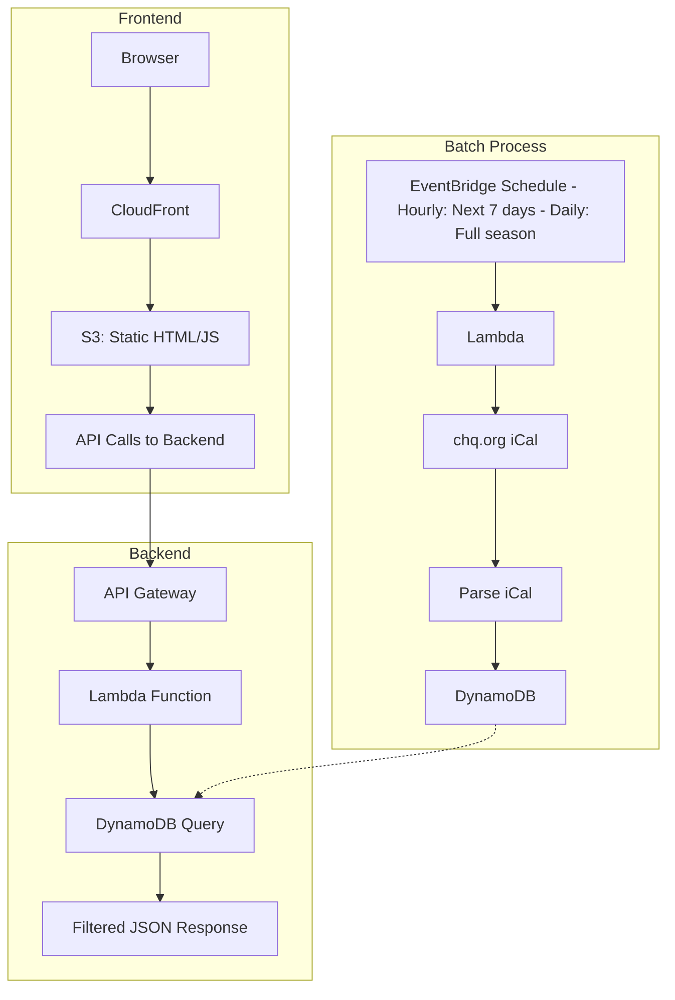
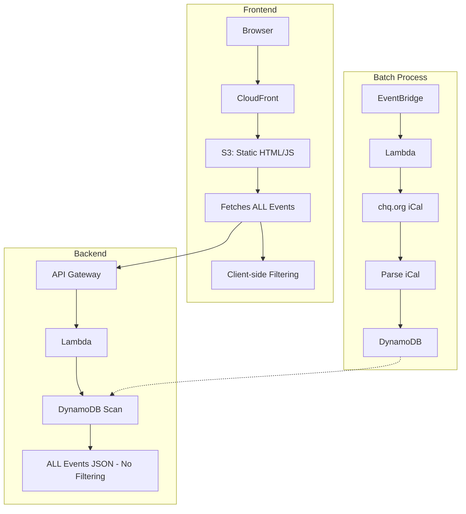
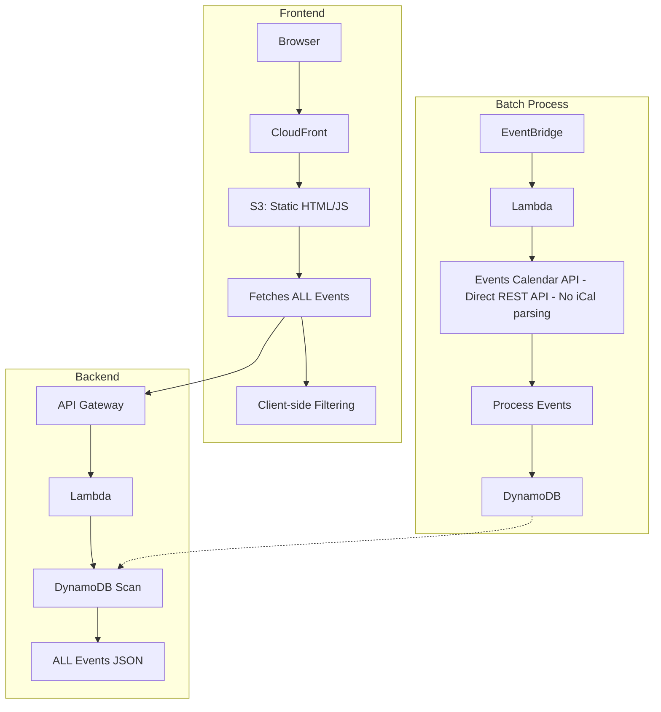
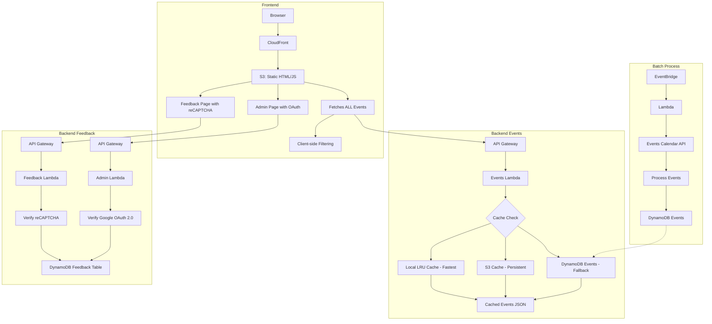
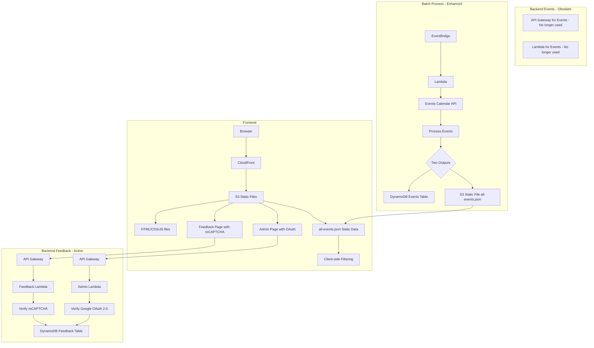
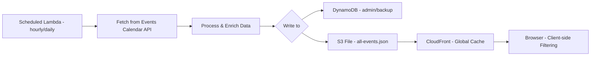
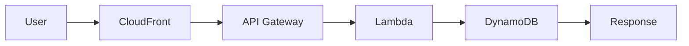
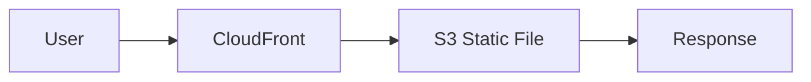

# Development History

## Overview

This document chronicles the architectural evolution of the Chautauqua Calendar application, from its initial design as a traditional backend-driven application to its current state as a highly optimized, edge-cached static site with global content distribution. Understanding this evolution helps explain current code patterns and identifies opportunities for future cleanup.

## System Components

The Chautauqua Calendar consists of three main components that evolved independently:

1. **Frontend**: Next.js application compiled to static HTML/JS files
2. **Backend**: Data delivery system (evolved from Lambda API to static JSON)
3. **Batch Process**: Data synchronization system (Lambda function)

## Architecture Diagrams

### Phase 1: Initial Architecture with iCal Import

### Phase 2: Frontend Filtering (All Data to Client)

### Phase 3: Direct API Integration

### Phase 4: Caching Layers and Feedback System Added

### Phase 5: Current Architecture (Static JSON File)

## Timeline of Architectural Changes

### Phase 1: Initial Design (Traditional Three-Tier Architecture)

**Components:**
- **Frontend**: Next.js static export served from S3/CloudFront
- **Backend**: Lambda function accessed via API Gateway for filtered event data
- **Batch Process**: Scheduled Lambda importing from chq.org iCal export

**Key Characteristics:**
- Traditional client-server architecture
- Backend responsible for filtering logic
- Batch process keeps DynamoDB populated with current data
- Each user request triggers Lambda execution and database query

### Phase 2: Frontend Filtering Revolution

**Key Insight:** The entire season's events (~1000 items) fit comfortably in browser memory.

**What Changed:**
- Backend now returns ALL events (removed filtering logic)
- Frontend handles all filtering client-side
- Batch process unchanged (still importing from iCal)

**Benefits:**
- Instant filtering without network requests
- Dramatically improved user experience
- Reduced backend complexity

### Phase 3: API Integration Upgrade

**Discovery:** The chq.org calendar uses The Events Calendar plugin with a REST API.

**What Changed:**
- Batch process now calls API instead of parsing iCal
- Frontend and backend unchanged
- More reliable data with richer metadata

**Benefits:**
- Eliminated complex iCal parsing
- Access to venue IDs, categories, and images
- More reliable data structure

### Phase 4: Performance Optimization via Caching + Feedback System

**Realizations:** 
- All users receive identical event data (no personalization)
- Need for user feedback system with bot protection and secure admin access

**What Changed:**
- Added multi-layer caching to backend Lambda for events
- Local LRU cache for warm Lambda instances
- S3 cache for persistence across Lambda cold starts
- **NEW: Feedback system with multiple components:**
  - Feedback form with Google reCAPTCHA verification
  - Separate Lambda function for feedback submission
  - Dedicated DynamoDB table for feedback storage
  - Admin interface with Google OAuth 2.0 authentication
  - Whitelist-based access control for admin users
- Batch process unchanged

**Benefits:**
- Dramatic performance improvement for events
- Reduced DynamoDB read costs
- Better scalability
- **Secure feedback collection** with bot protection
- **Protected admin access** for feedback review

### Phase 5: Architectural Simplification (Current State)

**Revolutionary Insight:** If event data is static and cached in S3, why use Lambda at all for events?

**What Changed:**
- Batch process now generates static JSON file in S3
- Frontend fetches `/cache/calendar-cache/all-events.json` directly from CloudFront
- Backend Lambda for events is obsolete
- **Feedback system remains active** with API Gateway and Lambda
- No API Gateway or Lambda execution for event data delivery

**Benefits:**
- **Performance:** Global edge caching for events, no compute latency
- **Cost:** Minimal costs for event delivery (S3 + CloudFront only)
- **Reliability:** Static files are bulletproof for core functionality
- **Simplicity:** Fewer moving parts for event data
- **Security:** Maintained secure feedback collection and admin access

## Current Architecture Details

### Data Flow

### Request Path Comparison

**Before (Phases 1-4):**

**Now (Phase 5):**

## Code Cleanup Opportunities

### Can Be Removed (Events-Related Only)
1. **Calendar Lambda Function** (`calendarHandler`)
   - `/api/calendar` endpoint logic
   - Event filtering code
   - DynamoDB event query logic
   - Event caching implementation

2. **API Gateway Configuration for Events**
   - Calendar endpoints (`/api/calendar`)
   - CORS configuration for event API

3. **Frontend API Calls for Events**
   - Dynamic event fetching logic
   - API error handling for events
   - Loading states for event API calls

### Must Be Retained (Active Systems)
1. **Batch Process Lambda** (`syncHandler`)
   - API integration with Events Calendar
   - Event processing and enrichment
   - Static file generation
   - S3 upload logic

2. **Feedback System Components**
   - **Feedback Lambda** (`feedbackHandler`) - reCAPTCHA verification and storage
   - **Admin Lambda** (`adminHandler`) - OAuth authentication and feedback access
   - **API Gateway** for feedback and admin endpoints
   - **DynamoDB Feedback Table** for feedback storage
   - **Frontend feedback pages** with reCAPTCHA integration

3. **Frontend Core**
   - All filtering logic
   - Static file fetching (`/cache/calendar-cache/all-events.json`)
   - Client-side state management
   - Feedback form and admin interface

### Why Feedback System Must Remain
The feedback functionality requires dynamic server-side processing that cannot be replaced with static files:
- **reCAPTCHA verification** needs server-side validation
- **OAuth authentication** requires secure token handling
- **Database operations** for storing and retrieving feedback
- **Access control** via whitelist validation

## Lessons Learned

1. **Challenge Assumptions**: Traditional backend wasn't necessary
2. **Measure Data Size**: Understanding ~1000 events fit in memory was pivotal
3. **Leverage Platform**: CloudFront eliminated custom caching needs
4. **Simplicity Scales**: Static files handle any load automatically
5. **Incremental Evolution**: Each phase built on previous learnings

## Architectural Advantages

### Performance
- **Global Distribution**: Events cached at 400+ edge locations
- **Zero Compute Latency**: No Lambda cold starts
- **Instant Filtering**: All logic client-side

### Cost
- **No Lambda Invocations**: For event data requests (99% of traffic)
- **No API Gateway Charges**: For event endpoints
- **Minimal DynamoDB Reads**: Only for feedback and admin operations
- **Predictable Costs**: Event delivery based on storage and bandwidth only

### Reliability
- **No Single Point of Failure**: Static files are highly available
- **Graceful Degradation**: Cached data survives update failures
- **Automatic Scaling**: CDN handles any traffic spike

### Simplicity
- **Fewer Components**: Reduced system complexity
- **Easy Debugging**: Static file issues are straightforward
- **Simple Deployment**: Just upload files

## Future Considerations

The beauty of the current architecture is its simplicity. Any enhancements should preserve the core principle: **static data with client-side interactivity**.

Potential improvements:
- Service Worker for offline access
- Differential updates (only changed events)
- WebSocket for real-time updates during events

## Conclusion

The Chautauqua Calendar demonstrates how architectural evolution can lead to radical simplification. By recognizing that all users receive identical data, we eliminated entire system layers while improving every metric: performance, cost, reliability, and maintainability.

The journey from a traditional three-tier architecture to a static file served via CDN shows that the best solution is often the simplest one that solves the problem effectively.

---

*Document Version: 2.0*
*Last Updated: July 27, 2025*
*Author: Bernie Bernstein with architectural insights from development history*
