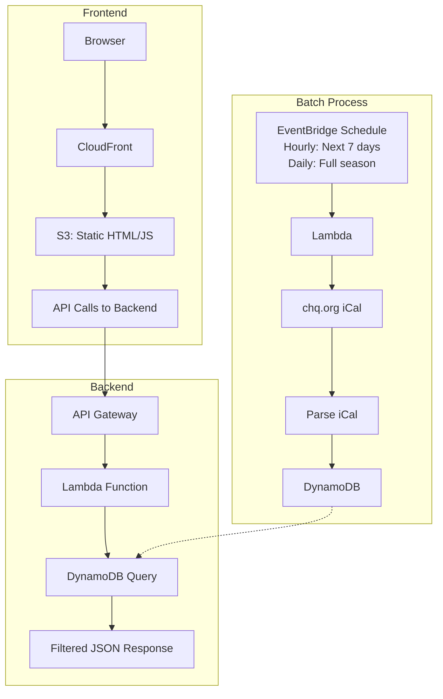
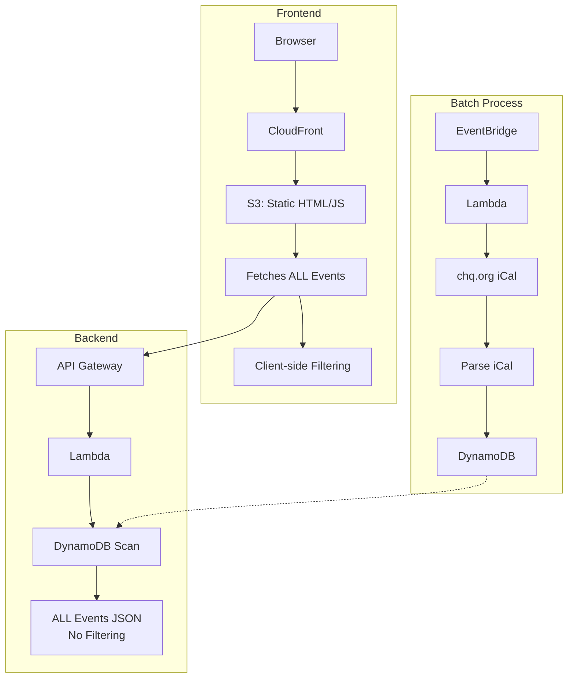
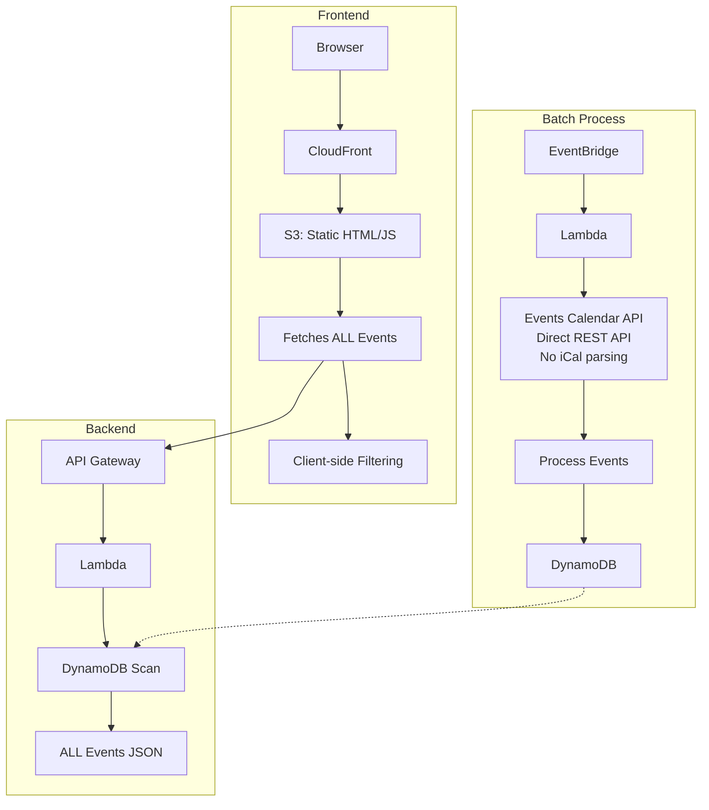
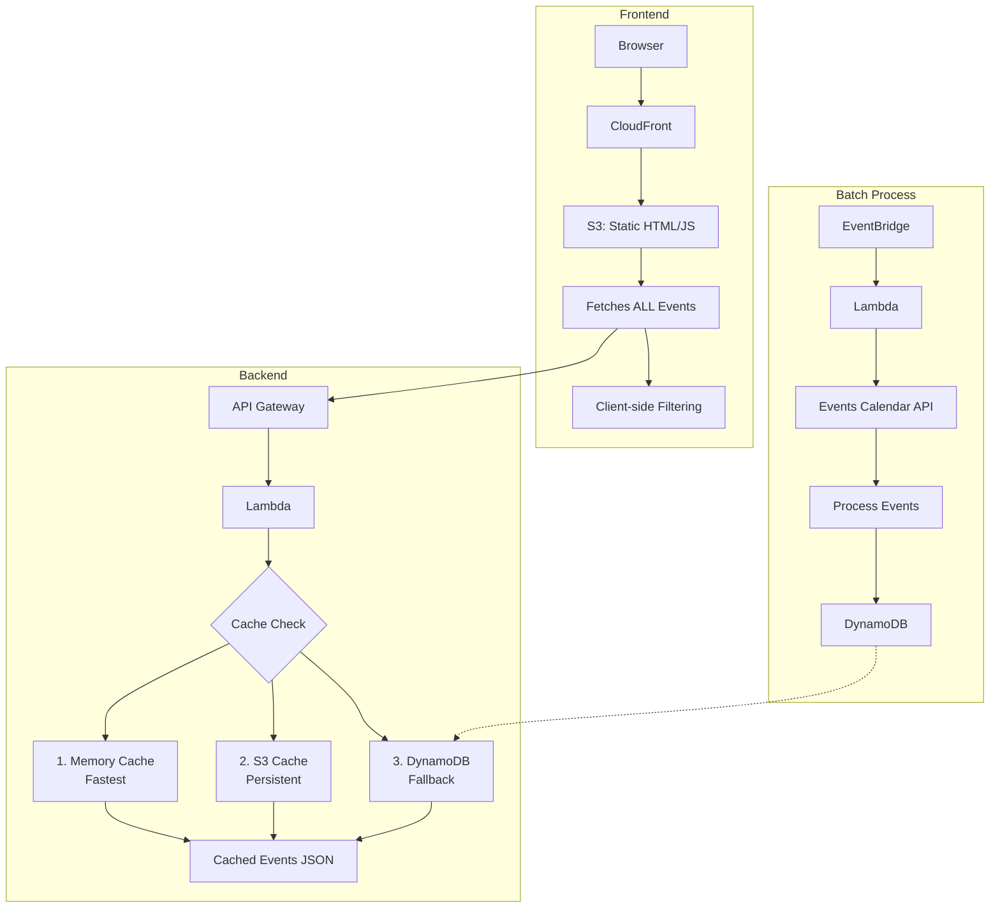
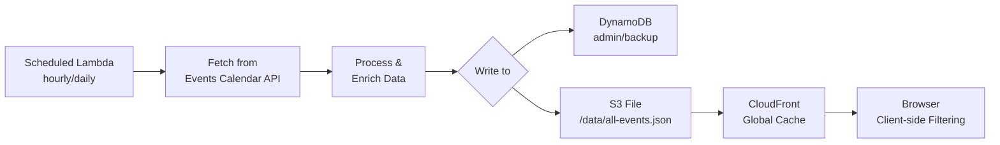
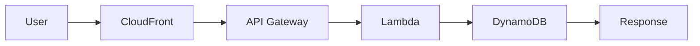
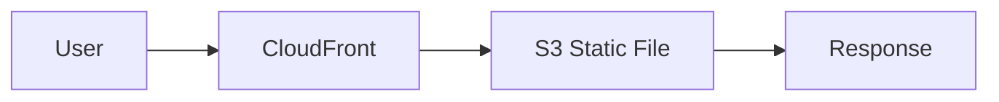

# Development History

## Overview

This document chronicles the architectural evolution of the Chautauqua Calendar application, from its initial design as a traditional backend-driven application to its current state as a highly optimized, edge-cached static site with global content distribution. Understanding this evolution helps explain current code patterns and identifies opportunities for future cleanup.

## System Components

The Chautauqua Calendar consists of three main components that evolved independently:

1. **Frontend**: Next.js application compiled to static HTML/JS files
2. **Backend**: Data delivery system (evolved from Lambda API to static JSON)
3. **Batch Process**: Data synchronization system (Lambda function)

## Architecture Diagrams

### Phase 1: Initial Architecture with iCal Import



### Phase 2: Frontend Filtering (All Data to Client)



### Phase 3: Direct API Integration



### Phase 4: Caching Layers Added



### Phase 5: Current Architecture (Static JSON File)

```mermaid
graph TB
    subgraph Frontend5[Frontend]
        Browser5[Browser] --> CF5[CloudFront]
        CF5 --> S3Static[S3 Static Files]
        S3Static --> HTMLFiles[/index.html<br/>CSS/JS files]
        S3Static --> EventsJSON[/data/all-events.json<br/>Static Event Data]
        EventsJSON --> ClientFilter5[Client-side Filtering]
    end
    
    subgraph BackendObsolete[Backend - Obsolete]
        ObsoleteAPI[API Gateway<br/>No longer used]
        ObsoleteLambda[Lambda for Events<br/>No longer used]
        AdminLambda[Admin Lambda<br/>Feedback management]
    end
    
    subgraph BatchProcessEnhanced[Batch Process - Enhanced]
        Schedule5[EventBridge] --> Lambda9[Lambda]
        Lambda9 --> EventsAPI5[Events Calendar API]
        EventsAPI5 --> Process5[Process Events]
        Process5 --> TwoOutputs{Two Outputs}
        TwoOutputs --> DDB6[DynamoDB<br/>Admin/Backup]
        TwoOutputs --> StaticFile[S3 Static File<br/>/data/all-events.json]
        StaticFile --> CF5
    end
```

## Timeline of Architectural Changes

### Phase 1: Initial Design (Traditional Three-Tier Architecture)

**Components:**
- **Frontend**: Next.js static export served from S3/CloudFront
- **Backend**: Lambda function accessed via API Gateway for filtered event data
- **Batch Process**: Scheduled Lambda importing from chq.org iCal export

**Key Characteristics:**
- Traditional client-server architecture
- Backend responsible for filtering logic
- Batch process keeps DynamoDB populated with current data
- Each user request triggers Lambda execution and database query

### Phase 2: Frontend Filtering Revolution

**Key Insight:** The entire season's events (~1000 items) fit comfortably in browser memory.

**What Changed:**
- Backend now returns ALL events (removed filtering logic)
- Frontend handles all filtering client-side
- Batch process unchanged (still importing from iCal)

**Benefits:**
- Instant filtering without network requests
- Dramatically improved user experience
- Reduced backend complexity

### Phase 3: API Integration Upgrade

**Discovery:** The chq.org calendar uses The Events Calendar plugin with a REST API.

**What Changed:**
- Batch process now calls API instead of parsing iCal
- Frontend and backend unchanged
- More reliable data with richer metadata

**Benefits:**
- Eliminated complex iCal parsing
- Access to venue IDs, categories, and images
- More reliable data structure

### Phase 4: Performance Optimization via Caching

**Realization:** All users receive identical data (no personalization).

**What Changed:**
- Added multi-layer caching to backend Lambda
- Memory cache for warm Lambda instances
- S3 cache for persistence across Lambda cold starts
- Batch process and frontend unchanged

**Benefits:**
- Dramatic performance improvement
- Reduced DynamoDB read costs
- Better scalability

### Phase 5: Architectural Simplification (Current State)

**Revolutionary Insight:** If data is static and cached in S3, why use Lambda at all?

**What Changed:**
- Batch process now generates static JSON file in S3
- Frontend fetches `/data/all-events.json` directly from CloudFront
- Backend Lambda for events is obsolete (admin Lambda remains)
- No API Gateway, no Lambda execution for event data

**Benefits:**
- **Performance:** Global edge caching, no compute latency
- **Cost:** Only S3 storage and CloudFront transfer costs
- **Reliability:** Static files are bulletproof
- **Simplicity:** Fewer moving parts

## Current Architecture Details

### Data Flow



### Request Path Comparison

**Before (Phases 1-4):**


**Now (Phase 5):**


## Code Cleanup Opportunities

### Can Be Removed
1. **Lambda Function** (`calendarHandler`)
   - `/api/calendar` endpoint logic
   - Event filtering code
   - DynamoDB query logic
   - Caching implementation

2. **API Gateway Configuration**
   - Calendar endpoints
   - CORS configuration for API
   - Request/response mappings

3. **Frontend API Calls**
   - Dynamic event fetching logic
   - API error handling
   - Loading states for API calls

### Must Be Retained
1. **Batch Process Lambda** (`syncHandler`)
   - API integration
   - Event processing
   - Static file generation
   - S3 upload logic

2. **Admin Lambda** (`adminHandler`)
   - Feedback system
   - Authentication
   - Admin operations

3. **Frontend**
   - All filtering logic
   - Static file fetching
   - Client-side state management

## Lessons Learned

1. **Challenge Assumptions**: Traditional backend wasn't necessary
2. **Measure Data Size**: Understanding ~1000 events fit in memory was pivotal
3. **Leverage Platform**: CloudFront eliminated custom caching needs
4. **Simplicity Scales**: Static files handle any load automatically
5. **Incremental Evolution**: Each phase built on previous learnings

## Architectural Advantages

### Performance
- **Global Distribution**: Events cached at 400+ edge locations
- **Zero Compute Latency**: No Lambda cold starts
- **Instant Filtering**: All logic client-side

### Cost
- **No Lambda Invocations**: For user requests
- **No API Gateway Charges**: For event endpoints  
- **Minimal DynamoDB Reads**: Only for admin operations
- **Predictable Costs**: Based on storage and bandwidth

### Reliability
- **No Single Point of Failure**: Static files are highly available
- **Graceful Degradation**: Cached data survives update failures
- **Automatic Scaling**: CDN handles any traffic spike

### Simplicity
- **Fewer Components**: Reduced system complexity
- **Easy Debugging**: Static file issues are straightforward
- **Simple Deployment**: Just upload files

## Future Considerations

The beauty of the current architecture is its simplicity. Any enhancements should preserve the core principle: **static data with client-side interactivity**.

Potential improvements:
- Service Worker for offline access
- Differential updates (only changed events)
- WebSocket for real-time updates during events

## Conclusion

The Chautauqua Calendar demonstrates how architectural evolution can lead to radical simplification. By recognizing that all users receive identical data, we eliminated entire system layers while improving every metric: performance, cost, reliability, and maintainability.

The journey from a traditional three-tier architecture to a static file served via CDN shows that the best solution is often the simplest one that solves the problem effectively.

---

*Document Version: 2.0*  
*Last Updated: July 27, 2025*  
*Author: Bernie Bernstein with architectural insights from development history*